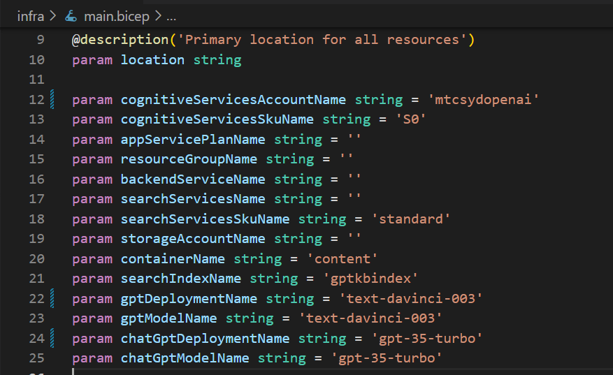
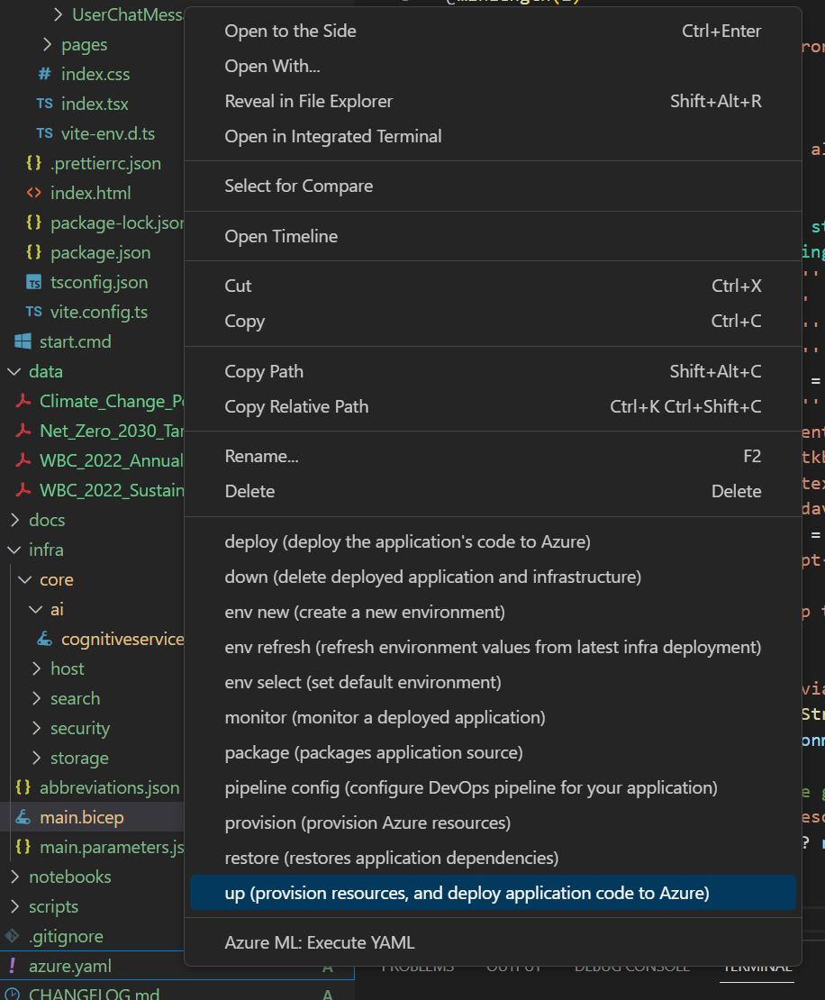

At this point you're probably facing deployment errors due to existing azure open ai deployments. We need to make some changes to the files to support this.

## Make changes to the Main Bicep file

This is where you need to put in your Azure Open AI details

Under the infra folder in the main.bicep file, check that you've got the right names associated with
1. cognitiveServicesAccountName -> this is the name of your Azure Open AI Service
2. gptDeploymentName and gptModelName -> this is the davinci model
3. chatGptDeploymentName and chatGptModelName -> this is the chat gpt model

It should look similar to this

## Make changes to the Cognitiveservices.bicep file 

We need to tell the deployment engine that we have an existing Open AI deployment and where to find it

Find the below section and add the word *exisitng =* like below as well the name of the resource group that has your Open AI service. The rest can be commented out

`resource account 'Microsoft.CognitiveServices/accounts@2022-10-01' existing = {
  scope: resourceGroup('mtcAI')
  name: name
  }`

Additionally change the deployments section

`resource deployment 'Microsoft.CognitiveServices/accounts/deployments@2022-10-01' existing = [for deployment in deployments: {
  parent: account
  name: deployment.name }]`

## Add your PDFs 
The data folder holds all the PDFs that will be uploaded, have their text information extracted, and tokenized in preperation for the chat engine to work against it. 
 
## Redeploy & Test

In Visual Studio Code, right click the yaml file and click *up* 

This step can take a while. 

If all goes well, use the link provided in the output of the deployment and test that the chat interface works as intended. 

