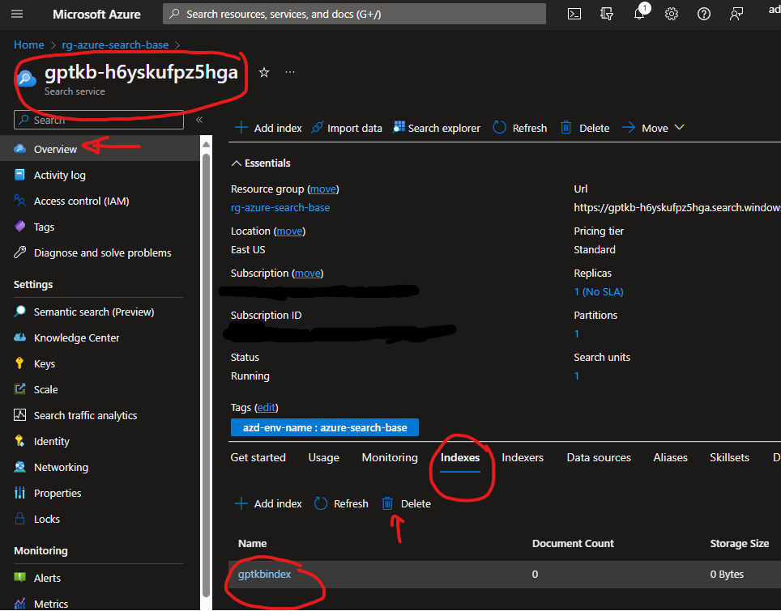
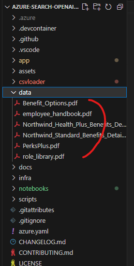

# Module 4: Load your own data

You can load unstructured data (PDF) and/or structured data (CSV) into the search service so that GPT can query it.

---

## Delete existing demo data
The demo already contains sample PDFs files (from the fictional "Northwind" organisation) -- you will need to remove these to add yours.

### Steps
1. In the [Azure Portal](https://portal.azure.com/) find the search service called `gptkb-xxxxxxx` (the `xxxxxx` representing the random code generated when you deployed the demo).
2. Click on the **Indexes** tab halfway down the page.
3. Select the index `gptkbindex`
4. Click the delete button just above it

---

## Loading PDFs
PDFs are loaded from the demo repository on your local machine using either a PowerShell or Bash script.

### Steps
1. Delete the sample PDF files in the `data` folder.

    

2. Copy in your desired PDF files to that folder
3. In your Terminal (PowerShell) window, ensure you are in the base folder (e.g. `azure-search-openai-demo`)
4. Run `./scripts/prepdocs.ps1`
   - (For Linux users, run `./scripts/prepdocs.sh`)

If the script is successful, your documents should be available for searching immediately.

FYI: This script does some specific processing of PDF files:
- it parses them using Azure Forms Recogniser, to identify bodies of text, headings and embedded tables
- it them chunks the file into a series of "pages" (e.g. `myfile-1.pdf`) -- to make them digestible by the LLM API. These pages are what will be returned when searching the knowledge base.
- it reformats tables so that they can be viewed nicely in the frontend
- it uploads the text of pages into the search index, as well as storing the PDF versions in a Storage Container for viewing in the front end (when you click on the Citations under a response)

---

## Loading CSV Files
Refer to [CSVLoader instructions](https://github.com/leongj/azure-search-demo-csv-loader)

