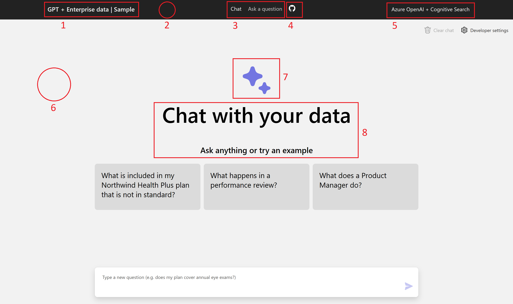

# Module 6: Change the branding and look & feel

## Overview

In this section, we'll talk about how to customise the design from the default UI provided in the [source repository](https://github.com/Azure-Samples/azure-search-openai-demo).

## Quick reference guide

To find the source of each labelled component of the UI from the image below, go to the corresponding numbered heading.



### 1. Navbar left title
---

Found in `app/frontend/src/pages/layout/Layout.tsx`. The title text itself is set in line 13, inside of a h3 tag. Edit the text inside of the h3 tag to change the title. Note that this header title is also a link to the homepage of the app, i.e. the '/' route.

``` tsx
<Link to="/" className={styles.headerTitleContainer}>
    <h3 className={styles.headerTitle}>GPT + Enterprise data | Sample</h3>
</Link>
```

The title's colour is set in `app/frontend/src/pages/layout/Layout.module.css`, inside the `headerTitleContainer` CSS block starting line 20. To change the colour, alter the pre-existing `color` property to a desired hexadeical colour code:

``` css
.headerTitleContainer {
    display: flex;
    align-items: center;
    margin-right: 40px;
    color: #f2f2f2;
    text-decoration: none;
}
```

### 2. Navbar background colour
---

Found in `app/frontend/src/pages/layout/Layout.module.css`. The background colour is set in the `header` CSS block starting line 7. Alter the pre-existing `background-colour` property to your desired hex colour code.

``` css
.header {
    background-color: #222222;
    color: #f2f2f2;
}
```

### 3. Navbar chat buttons
---

Both "Chat" and "Ask a question" are found in `app/frontend/src/pages/layout/Layout.tsx`. The text for the "Chat" button is in line 19. The text for the "Ask a question" button is in line 24. Edit the raw text on each line to your desired naming.

``` tsx
<NavLink to="/" className={({ isActive }) => (isActive ? styles.headerNavPageLinkActive : styles.headerNavPageLink)}>
    Chat
</NavLink>
```

``` tsx
<NavLink to="/qa" className={({ isActive }) => (isActive ? styles.headerNavPageLinkActive : styles.headerNavPageLink)}>
    Ask a question
</NavLink>
```

### 4. Navbar logo
---

The original logo is the GitHub icon. The image is stored inside the `app/frontend/src/assets` folder. You will find `github.svg` there. Using a `.svg` file is recommend, but a screenshot of your desired logo works fine. The image is imported in `app/frontend/src/pages/layout/Layout.tsx`. At the top of the file, it is imported at line 3.

``` typescript
import github from "../../assets/github.svg";
```

Then, in the same file (`Layout.tsx`) scroll down to the following section, starting line 28. This is where the imported image is used.

``` typescript
<a href="https://aka.ms/entgptsearch" target={"_blank"} title="Github repository link">
    
</a>
```

To use your own logo, just replace everything with your own. That is, save your own logo into the `assets` folder, import it in thr `Layout.tsx` file, then use it where the GitHub logo was used in the above code snippet. In the default state, the logo is inside a href tag containing a link to `https://aka.ms/entgptsearch`. You may change this link to any URL of your choosing.

### 5. Navbar right title
---

The right title is found in `app/frontend/src/pages/layout/Layout.tsx`. The text is in line 41. Edit the raw text to your desired naming.

``` tsx
<h4 className={styles.headerRightText}>Azure OpenAI + Cognitive Search</h4>
```

### 6. Chat background colour
---


### 7. Sparkle icon
---


### 8. Welcome text
---

The header is the bar at the top of the page that contains the title of the app. We can change the text in the header by changing the text in the `title` tag in the `app/frontend/index.html` file.

### Navbar
---

The navbar is the bar at the top of the page that contains the title of the app and the links to the different pages, along with a logo. 

#### Colour
---

TBC.

To change the colour of the navbar, by changing the `background-color` variable in the `Layout.module.css` file in `app/frontend/src/pages/layout`. We can change the color of the text in the navbar by changing the `color` variable in the same file.

### Chat
---

TBC

The chat is the central part of the page that contains the body of the app. We can change the color of the body by changing the `background-color` variable in the `app/frontend/src/pages/chat/Chat.module.css` file. We can change the color of the text in the same file. To change the star-shaped icon, we can change the `color` variable in the `app/frontend/src/pages/chat/Chat.tsx` file.

TBC

### Text
---

We can change the color of the text by changing the `color` variable in the `assets/style.css` file. We can change the font of the text by changing the `font-family` variable in the `assets/style.css` file. We can change the size of the text by changing the `font-size` variable in the `assets/style.css` file.